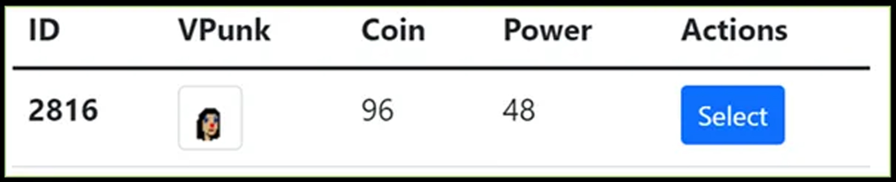

# 🔒 Zombie Defense game rules

## **Requirement**

* The Player needs to own at least one VPunks to play.

## **Rules**

* In the game there are all 25 rounds, with the milestones of 5, 10, 15, 20, 25 players will receive 20, 40, 60, 80, 100% POWER. After completing 25 rounds, players must wait until the next day to play again.
* Each Vpunk has one turn per day, you die at any round then stop at that round.

## The ability to earn $VPU is based on the following factors

* Players are rewarded from a pool of 8000 $VPU. Rewards from the pool are calculated and distributed every twenty-four (24) hours; resets daily at 00:00 UTC.
* A player may play Zombie Defense P2E mode once daily with each VPunk they own.
* Players will receive their share of the daily $VPU reward and may claim it after linking their wallet with C-Account.
* The Reward will be added to the [Funding wallet](https://vefam.com/#/account/wallet).
* A VPunk’s cumulative daily gaming WinPower is applied to the following formula to determine the amount of $VPU they will receive:

<figure><figcaption></figcaption></figure>

* The community’s total amassed WinPower may be viewed on the daily Leaderboard available on the Zombie Defense home page

<figure><figcaption></figcaption></figure>

* VPunks have starting WinPower values according to their rarity which dictates how much WinPower they can achieve by gaming

<figure><figcaption></figcaption></figure>

* VPunks earn more WinPower as they complete rounds according to the chart below:

<figure><figcaption></figcaption></figure>

* A VPunk’s gaming WinPower is determined by the following formula

<figure><figcaption></figcaption></figure>
